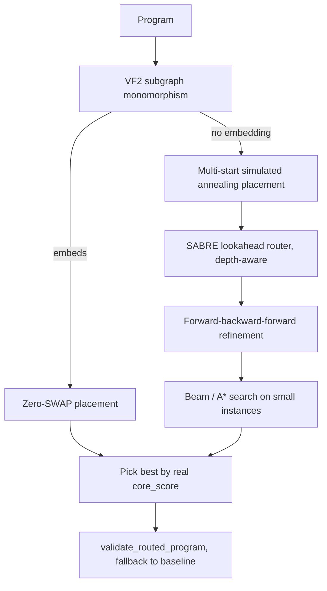

# Computational Track: Win Plan

## Decision
Computational Track. It has an objective scorer (`score = swaps + 0.5*depth`), small instances (20-qubit graph, at most 40 gates), and results an agent can iterate on without human judgment. Scientific Track is 85% subjective rubric. Skip the IonQ Duel because it is adversarial and depends on other teams.

## Key facts from the repo
- Scorer: [Computational Track/starter_kit/scorer.py](Computational Track/starter_kit/scorer.py). Depth is ASAP layering of the routed list. Any invalid output scores infinity, so we must always validate.
- Benchmarks: [Computational Track/starter_kit/benchmarks.py](Computational Track/starter_kit/benchmarks.py): `ghz_star`, `chain_trotter`, `ladder_trotter`, `qaoa_random`, `dense_random`, `vqe_layers`. Judges may use hidden programs, so `solve()` must be general and time-bounded.
- Hardware: [Computational Track/starter_kit/hardware.py](Computational Track/starter_kit/hardware.py) has a Hamiltonian path through all 20 qubits (`3-2-1-0-4-5-6-7-11-10-9-8-12-13-14-15-19-18-17-16`). Chain and VQE-layer programs therefore need 0 SWAPs.
- The 2Q gate orientation `(i, j)` must be preserved exactly, because `translated != program` fails validation.

## Architecture

## Phase 0: tonight, draft due (about 2-3 hours)
- New package `Computational Track/solution/`: `solve.py` exposing `solve(program, hardware_graph)`.
- Implement VF2 zero-SWAP placement, then SABRE-style routing with lookahead, plus a greedy fallback. Always validate, and fall back to the baseline if invalid.
- `bench.py` prints a per-benchmark table: baseline vs. ours, SWAPs, depth, score, valid, runtime.
- `WRITEUP_DRAFT.md`: 1 page with approach, current score table, and roadmap. Submit it with the notebook as the draft.

## Phase 1: autopilot optimization (overnight to deadline)
- Add lower bounds to `bench.py`: depth bound from the per-qubit gate count / program critical path, and a SWAP bound of 0 when VF2 embeds. The bounds show where the remaining gap is.
- Improvements, in order of expected gain:
  1. Simulated-annealing placement on a time-decayed distance cost, with many restarts.
  2. Depth-aware SWAP choice that prefers SWAPs on idle qubits so they run in parallel.
  3. SABRE bidirectional passes (use the final mapping from a reversed run as the initial placement).
  4. Beam search / A* over (mapping, gate index), with the exact score as the objective, for programs with 20 or fewer gates. This gets `ghz_star` and `ladder_trotter` to near-optimal.
  5. Randomized portfolio under a time budget (for example 30-60 s per program), keeping the best result.
- Robustness suite: random programs, 1Q gates, disconnected logical qubits, a single qubit, and an empty program. All must be valid.
- Autopilot loop: a Cursor agent (via the `/loop` skill or a goal) repeatedly runs `bench.py`, tries one improvement, and commits only if the total score drops and every run is valid.

## Phase 2: final polish
- Stretch goals A/B from the notebook section 7 (decompose / 1Q optimization bonus `N * 0.1`), only after the core score plateaus.
- Final 1-2 page writeup with figures from `starter_kit/visualize.py` (before/after routing animation) and a score table vs. baseline and lower bounds.
- 3-5 minute demo script: problem, zero-SWAP trick, algorithm pipeline, results table, and the provably optimal cases.
